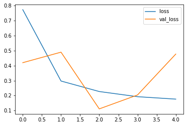

# Malaria_Detection_Model
This Model is used to detect whether the given sample has malaria parasite or not.

## About

This model use Convolutional neural network to train the model. Various tunning layers has been used to train the model like 

* Batch Normalization to tune in the layers
* Dropout to reduce the overfitting of the model

The model has been trained on more than 24000 images
Then the model has been tested on more than 26000 images
 
**To make the model more efficeint and to increase the training and test set Data Agumentation has been applied to apply various orientation to the existing images.**

### Dataset

The dataset for training and testing the model has been taken from the **National Library of Medicine**

* Training data is having images dataset till 2018
* Testing data is having image dataset till update

**I also used small testing data set from the github to evaluate the **Image_Generator****

### Accuracy and Loss Trend

# Loss Vs Validation_Loss 
 
 
 # Accuracy Vs Validation_Accuracy
 
 
 # Confusion Matrix
 

# Feature

After training this model, user and simply put the image path in the **user_image** variable and get the result whether the input image is infected or not

## Note
* If the result is 0, That means the cell is infected i.e **Parsitic**
* If the result is 1, That means the cell is **Unifected**

### Result

**The accuracy of this model is achieved upto 95.58%**
